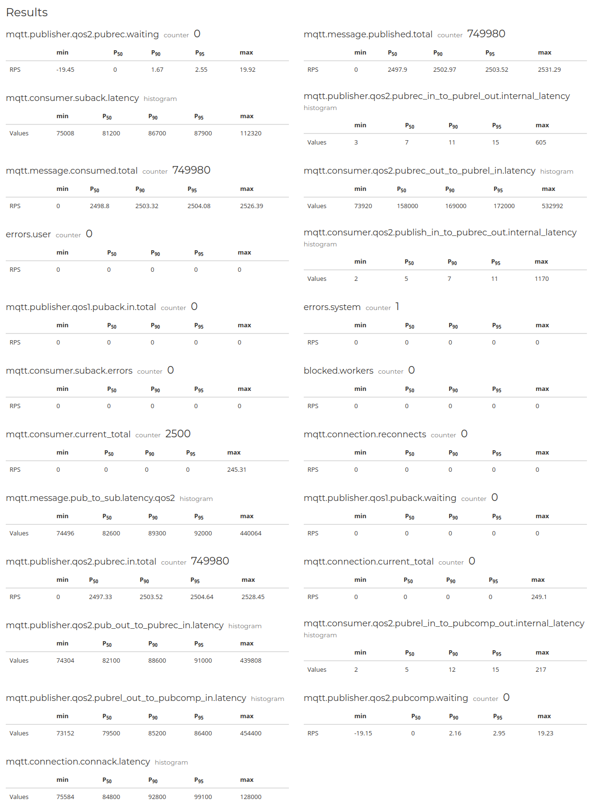
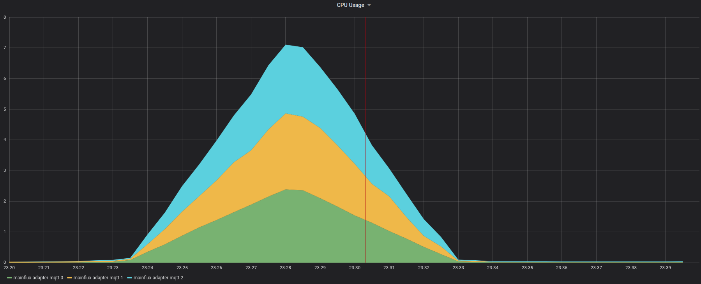

# Report from Digitalocean managed [Kubernetes cluster](https://www.digitalocean.com/products/kubernetes/).

Cluster size: 3 Nodes CPU Optimized droplet - 8 vCPU 16 GB RAM

Estimated droplet cost's for cluster: $480/month

Mainflux services scaled to 3 instances:

* Mqtt adapter
* Authn
* Things
* Redis-things
* Envoy
* Nats

## 1-to-1 Scenario

Clients pool: 2500

Test durition: 5min

RPS: 1

QoS Level: 2

In 1-to-1 test 2500 clients subscribe to an exclusive Mainflux channel and the same clients send one message every second on that channel to themselves.
No message loss was detected.

**NOTE:** Graphs Time unit is microsecond.

*We see total number of connections during test is constant*

---

*We see total number of published and consumed messages is the same*

---

*We see total number of messages per second (RPS) is 2500 for both publishing and receiving*

---

*Pub to Pubrec latency in microseconds (100k microseconds are 100 milliseconds) *

---
> Useful facts: 
>* 95% of clients had latency from 89ms up to 93ms
>* Max latency was up to 440ms

---

*Pub to sub latency in microseconds (100k microseconds are 100 milliseconds) *

---
> Useful facts: 
>* 95% of clients had latency from 91ms up to 94ms
>* Max latency was up to 440ms

---

Results metrics

*Results metrics are generated by mzbench tool*

---

### Kubernetes Cluster resources insights

*Kubernetes CPU usage in whole Mainflux namespace during testing*

---

*Kubernetes Memory usage in whole Mainflux namespace during testing*

---

*Kubernetes CPU usage in MQTT statefulset during testing*

---

*Kubernetes Memory usage in MQTT statefulset namespace during testing*

---

*Kubernetes Network receive/transmit bandwidth in MQTT statefulset namespace during testing*

