# Report from Digitalocean managed [Kubernetes cluster](https://www.digitalocean.com/products/kubernetes/).

Cluster size: 3 Nodes CPU Optimized droplet - 8 vCPU 16 GB RAM

Estimated droplet cost's for cluster: $480/month

Mainflux services scaled to 3 instances:

* Mqtt adapter
* Authn
* Things
* Redis-things
* Envoy
* Nats

## Fan-in Scenario

Publisher pool: 3000

Subscriber pool: 1

Test durition: 5min

RPS: 1

QoS Level: 2

In Fan-in test 3000 clients publishing to exclusive channel subtopic, and single subscriber consuming all sent messages.
Both publishers and subcriber are connected with QoS 2, which is the safest and most demanding quality of service level that guarantees that each message is received exactly once by the intended recipients by using a four-part handshake.

No message loss was detected.

**NOTE:** Graphs Time unit is microsecond.

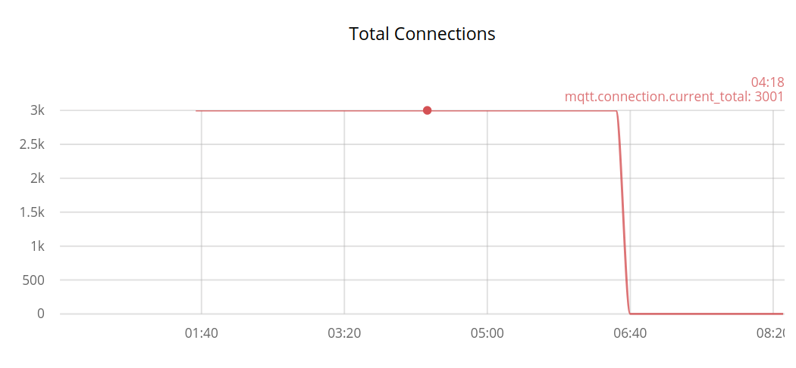

*We see total number of connections during test is constant*

---

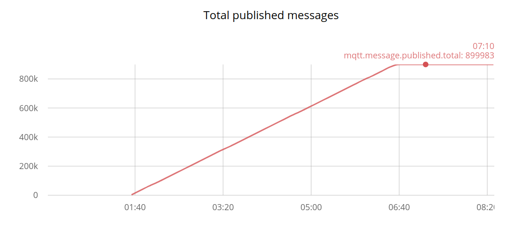
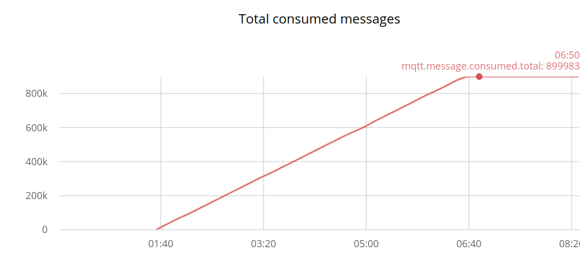

*We see total number of published and consumed messages is the same*

---

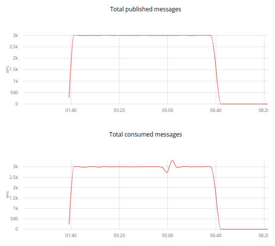

*We see total number of messages per second (RPS) is 3000 for both publishing and receiving*

---

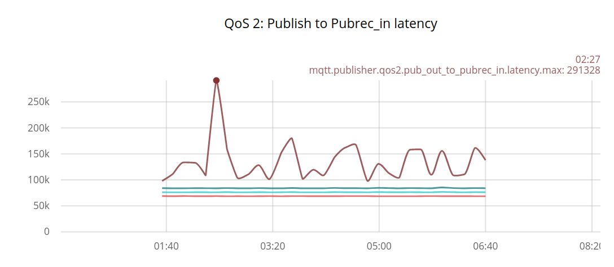

*Pub to Pubrec latency in microseconds (100k microseconds are 100 milliseconds) *

---
> Useful facts: 
>* 95% of clients had latency up to 85ms
>* Max latency was up to 292ms

---

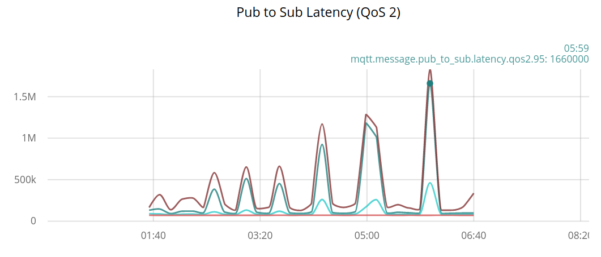

*Pub to sub latency in microseconds (100k microseconds are 100 milliseconds) *

---
> Useful facts: 
>* 95% of clients had latency up to 1660ms
>* Max latency was up to 1829ms

---

Results metrics
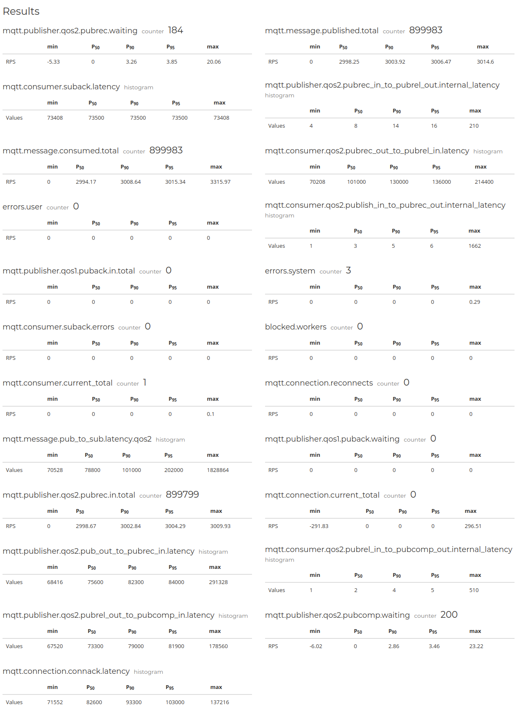

*Results metrics are generated by mzbench tool*

---

### Kubernetes Cluster resources insights
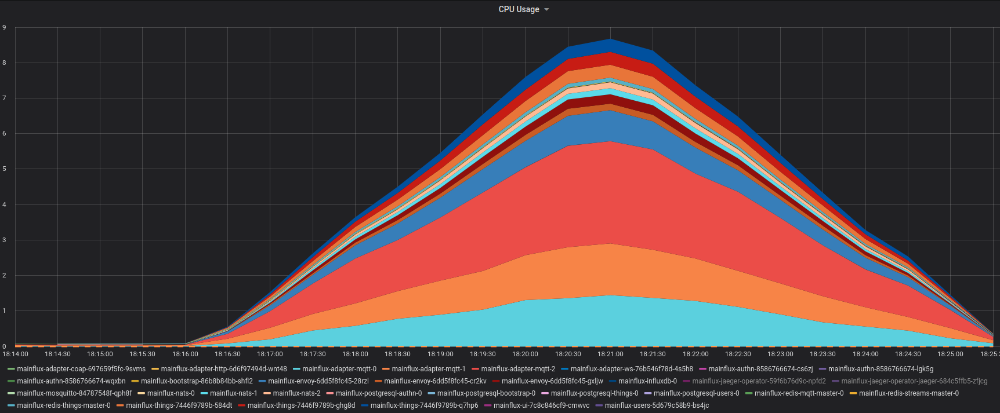

*Kubernetes CPU usage in whole Mainflux namespace during testing*

---

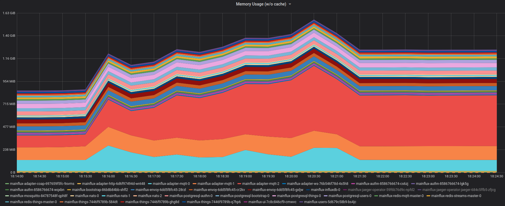

*Kubernetes Memory usage in whole Mainflux namespace during testing*

---

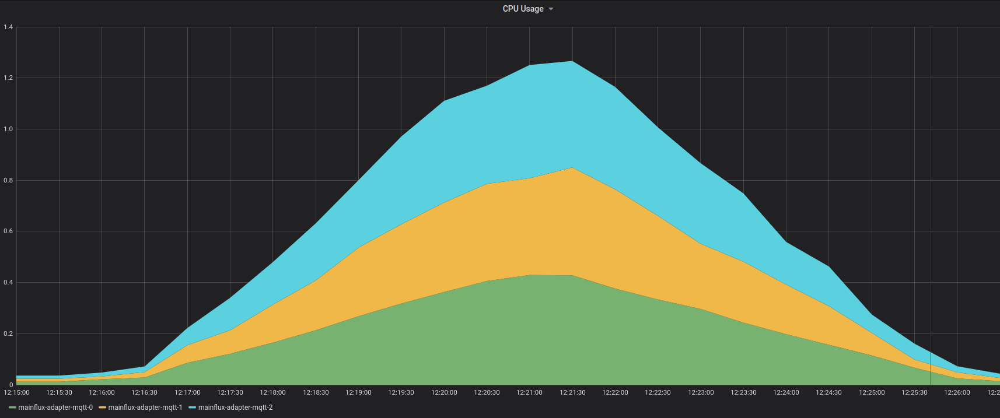

*Kubernetes CPU usage in MQTT statefulset during testing*

---

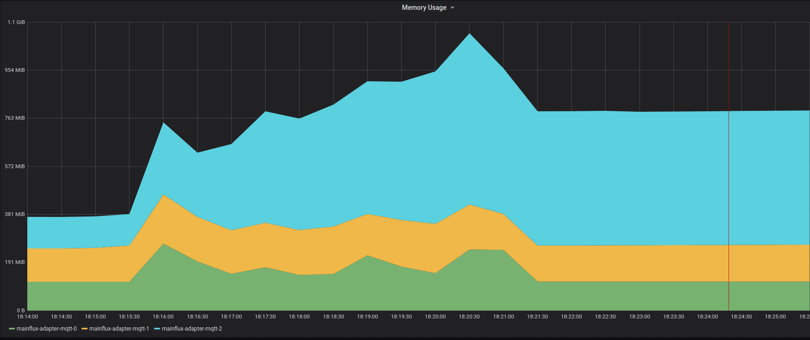

*Kubernetes Memory usage in MQTT statefulset during testing*

---

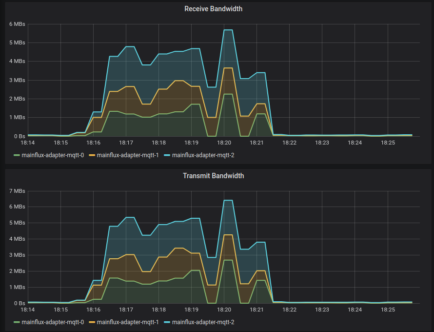

*Kubernetes Network receive/transmit bandwidth in MQTT statefulset during testing*

