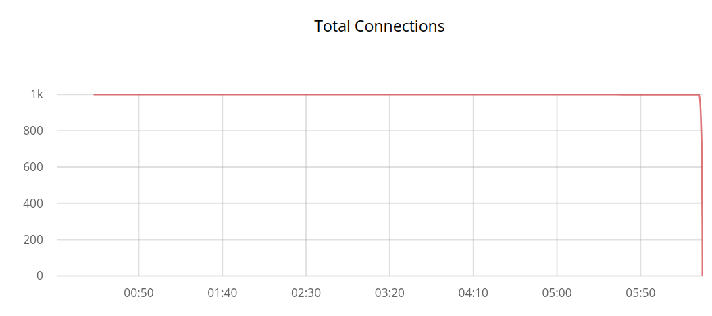
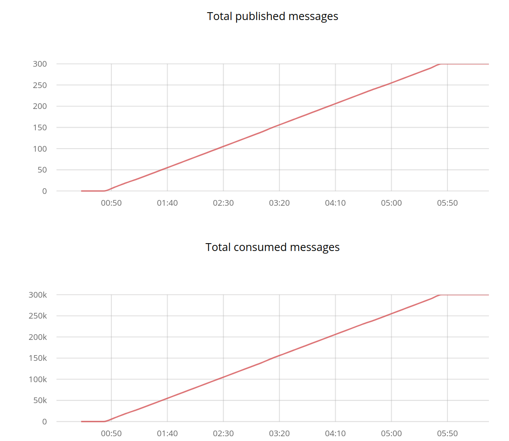
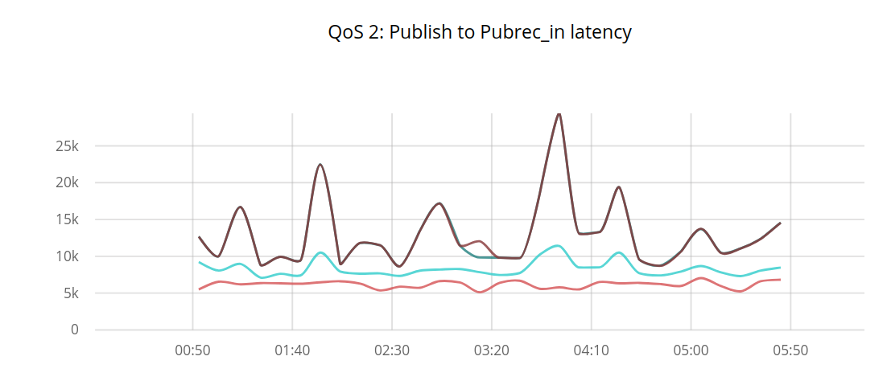
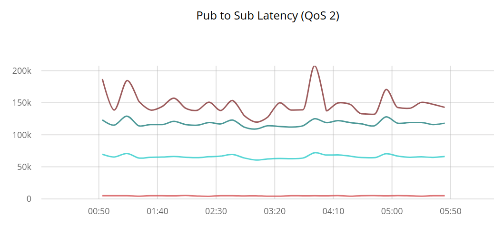
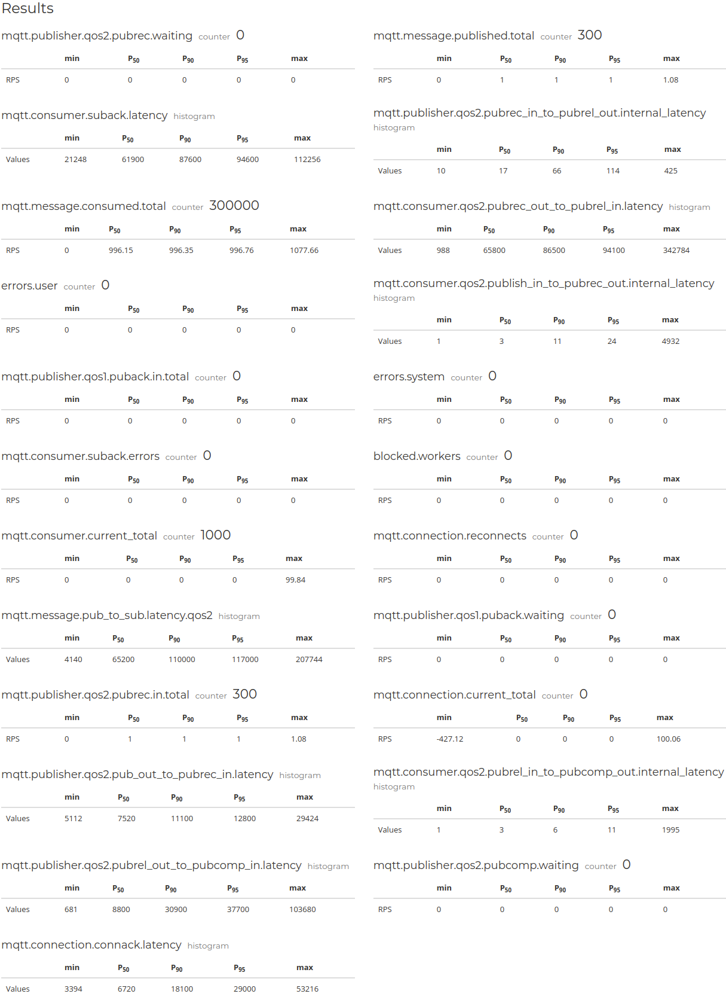
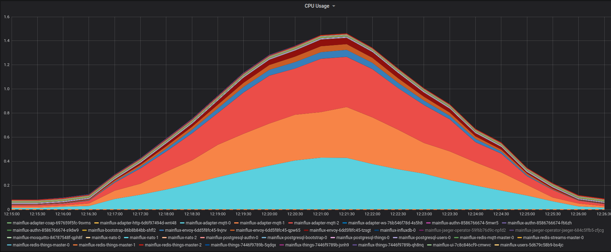
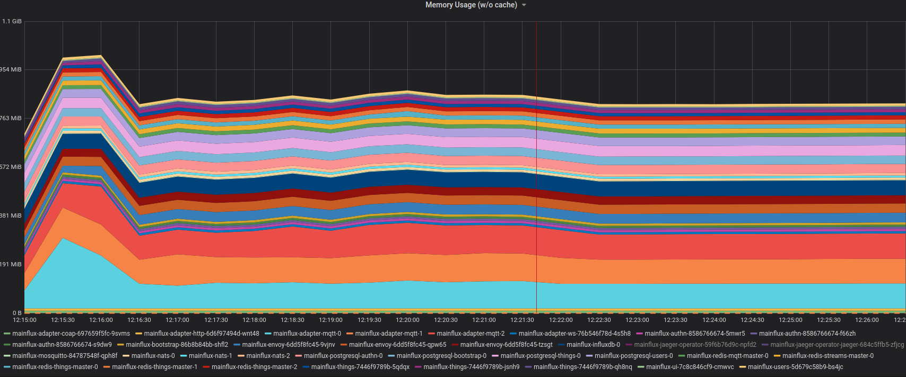
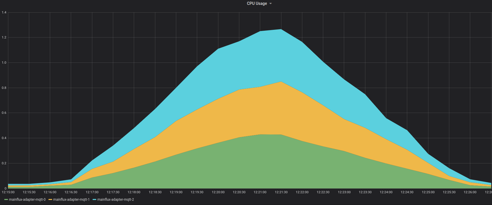
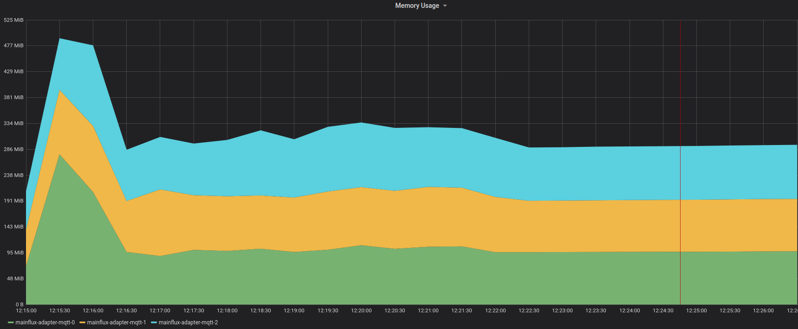
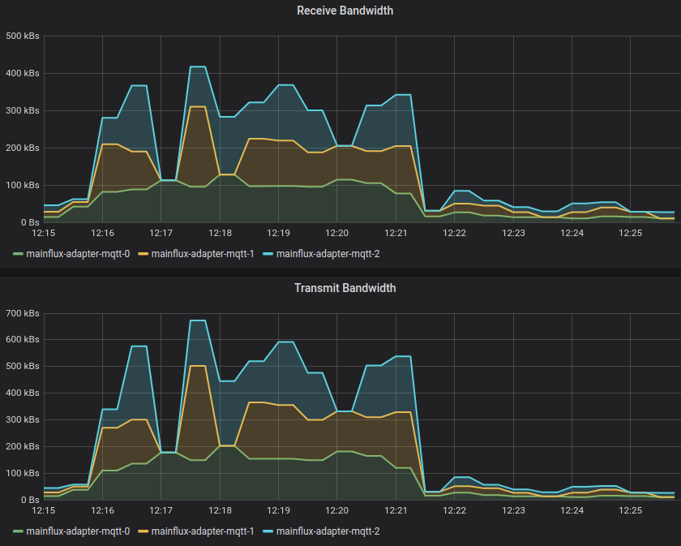

# Report from Digitalocean managed [Kubernetes cluster](https://www.digitalocean.com/products/kubernetes/).

Cluster size: 3 Nodes CPU Optimized droplet - 8 vCPU 16 GB RAM

Estimated droplet cost's for cluster: $480/month

Mainflux services scaled to 3 instances:

* Mqtt adapter
* Authn
* Things
* Redis-things
* Envoy
* Nats

## Fan-out Scenario

Publisher pool: 1

Subscriber pool: 1000

Test durition: 5min

RPS: 1

QoS Level: 2

In Fan-out test 1000 clients subscribe to same Mainflux channel and one publisher send one message every second over that channel to them.
Both publisher and subcribers are connected with QoS 2, which is the safest and most demanding quality of service level that guarantees that each message is received exactly once by the intended recipients by using a four-part handshake.

No message loss was detected.

**NOTE:** Graphs Time unit is microsecond.

*We see total number of connections during test is constant*

---

*We see total number of consumed messages is exactly 1000 times higher than the sent ones*

---

*Pub to Pubrec latency in microseconds (100k microseconds are 100 milliseconds) *

---
> Useful facts: 
>* 95% of clients had latency up to 12ms
>* Max latency was up to 29ms

---

*Pub to sub latency in microseconds (100k microseconds are 100 milliseconds) *

---
> Useful facts: 
>* 95% of clients had latency up to 130ms
>* Max latency was up to 207ms

---

Results metrics

*Results metrics are generated by mzbench tool*

---

### Kubernetes Cluster resources insights

*Kubernetes CPU usage in whole Mainflux namespace during testing*

---

*Kubernetes Memory usage in whole Mainflux namespace during testing*

---

*Kubernetes CPU usage in MQTT statefulset during testing*

---

*Kubernetes Memory usage in MQTT statefulset during testing*

---

*Kubernetes Network receive/transmit bandwidth in MQTT statefulset during testing*

