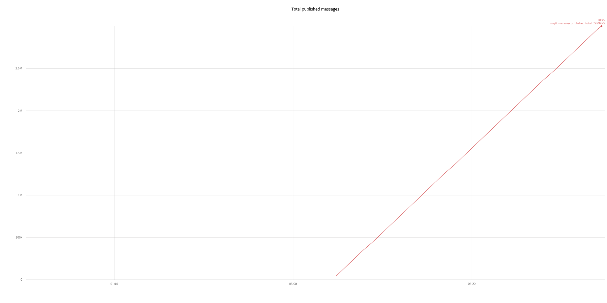
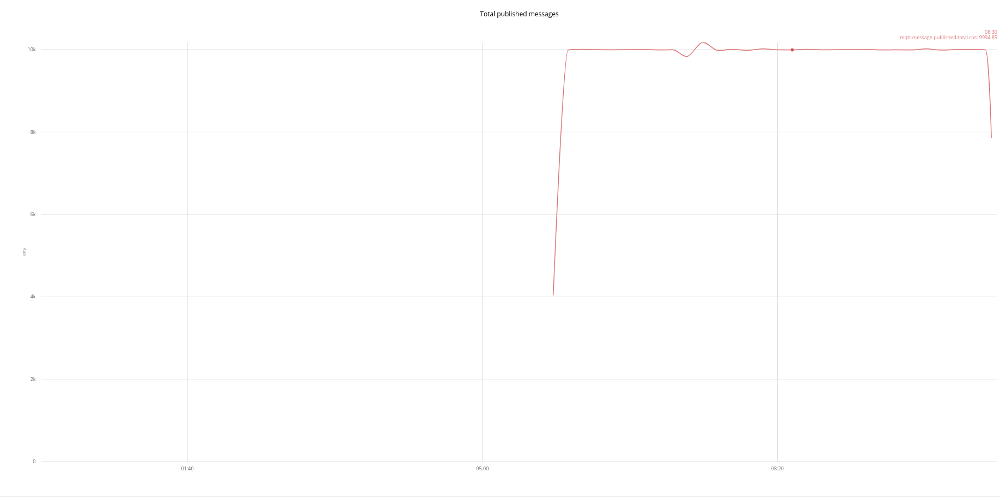
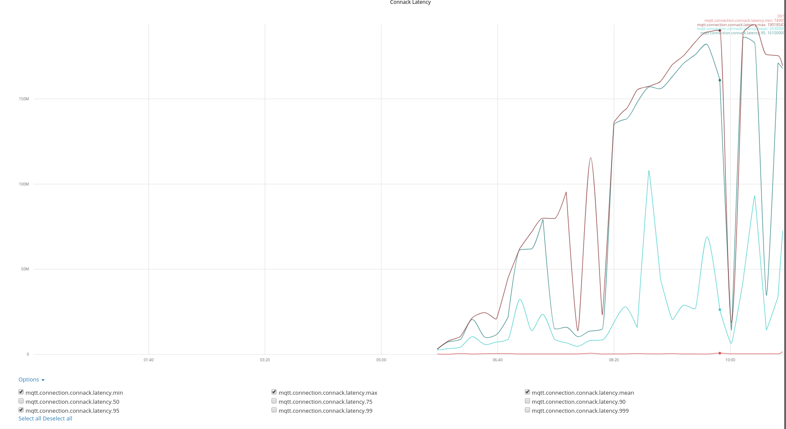
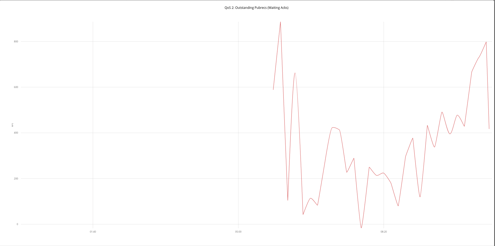
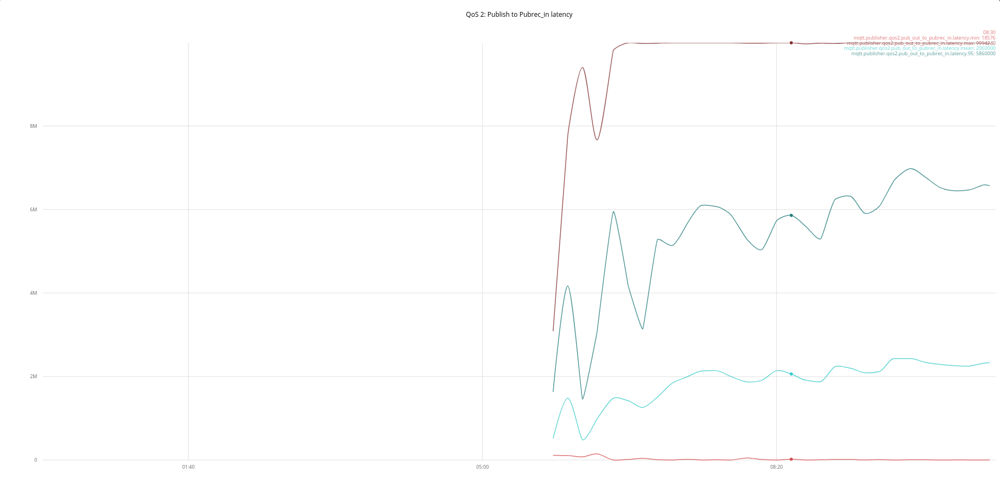
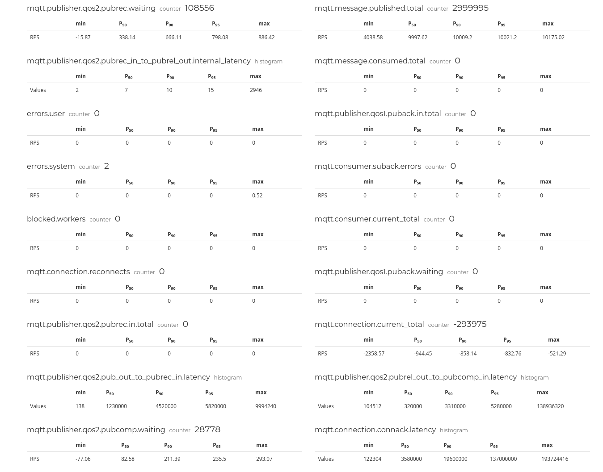
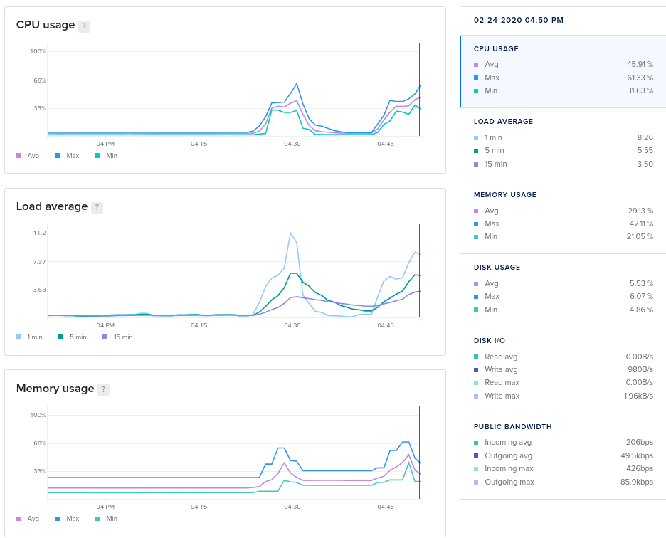

# Report from Digitalocean managed [Kubernetes cluster](https://www.digitalocean.com/products/kubernetes/).

Cluster size:  5 Nodes CPU Optimized droplet - 8 vCPU 16 GB RAM

Estimated droplet cost's for cluster: $800/month

Mainflux services scaled to 5 instances

* Mqtt adapter
* Things
* Envoy

## Fan-in Scenario

Publisher pool: 10 000

Subscriber pool: 1

Test durition: 5min

RPS: 1

QoS Level: 2

In this scenario, 10 000 publishers connets and sends 1 one message every second, one subscriber is receiving all those messages.

No message loss was detected.

**NOTE:** Graphs Time unit is microsecond.

*We see total number of messages 3M*

*We see total number of messages per second (PRS) is 10 000*

*We see total number of messages per second (PRS) is 10 000*

*We see connection ACK latency*

> Useful facts: 
>* Max latency was up to 20sec
>* 95% Of clients had latency from 5sec up to 15sec under high load
>* Avarge latency was 5sec without pekas

*We see Publish received ACK RPS*

*We see Total Publish received ACK Latency*

> Useful facts: 
>* Max latency was up to 8sec
>* 95% Of clients had latency from 0.5sec up to 6sec under high load
>* Avarge latency was ~2sec without pekas

Results metrics

*Results metrics are generated by mzbench tool*

### Kubernetes Cluster Node insights

*Digitalocean Kubernetes cluster node's insights during testing*

## Fan-out Scenario
TBA